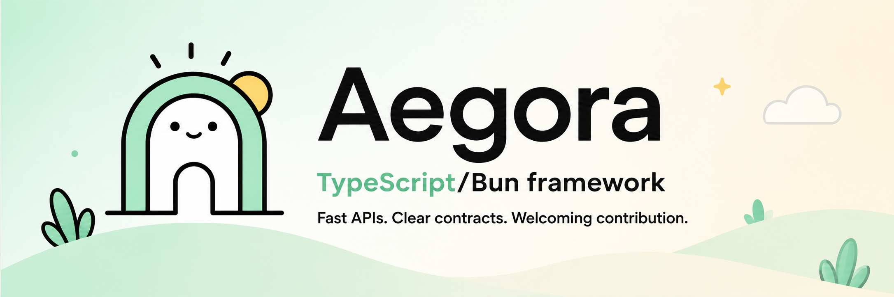

<p align="center">
  
</p>

<h1 align="center">Fast APIs. Clear contracts. Welcoming contribution.</h1>

<p align="center">
  Aegora is a community-led TypeScript/Bun framework for building reliable APIs with strong types, clear contracts, and a contributor culture built around mentorship.
</p>

<p align="center">
  <a href="#getting-started">Getting Started</a> ·
  <a href="#why-aegora">Why Aegora?</a> ·
  <a href="./ROADMAP.md">Roadmap</a> ·
  <a href="./CONTRIBUTING.md">Contributing</a> ·
  <a href="./GOVERNANCE.md">Governance</a>
</p>

---

## Getting Started

```ts
import { Aegora, t } from 'aegora'

const app = new Aegora()
  .get('/hello/:name', ({ params }) => ({
    message: `Hello ${params.name}`
  }), {
    params: t.Object({
      name: t.String()
    }),
    response: t.Object({
      message: t.String()
    })
  })

app.listen(3000)
```

## Why Aegora?

Aegora is built around three commitments:

1. **Reliable APIs** — strong types, clear runtime behavior, and production-minded tooling.
2. **Clear contracts** — first-class schema, documentation, and OpenAPI-oriented workflows.
3. **Welcoming contribution** — mentored issues, respectful reviews, transparent governance, and a path from first PR to maintainer.

## Initial Priorities

- Establish safe attribution and package identity.
- Build a contributor path that is clear, respectful, and beginner-friendly.
- Improve documentation around plugin authoring, testing, and production usage.
- Add structured OpenAPI 3.1 export as a flagship feature.
- Create official examples for common backend patterns.

## Community Promise

Aegora is not only a framework. It is a place to learn, contribute, and grow.

Contributors should expect respectful responses, clear reasons when ideas are declined, practical review feedback, and beginner-friendly issues with enough context to make progress.

Maintainers should expect good-faith participation, tested changes when possible, patience around volunteer time, and technical disagreement without personal attacks.

## Development

```bash
bun install
bun run test
bun run build
```

## Contributing

Start with [CONTRIBUTING.md](./CONTRIBUTING.md) and [MENTORSHIP.md](./MENTORSHIP.md).

For larger changes, open an issue or RFC-style discussion first so the community can align on design before implementation.

## License

Aegora is released under the MIT License. See [LICENSE](./LICENSE) and [NOTICE.md](./NOTICE.md).
